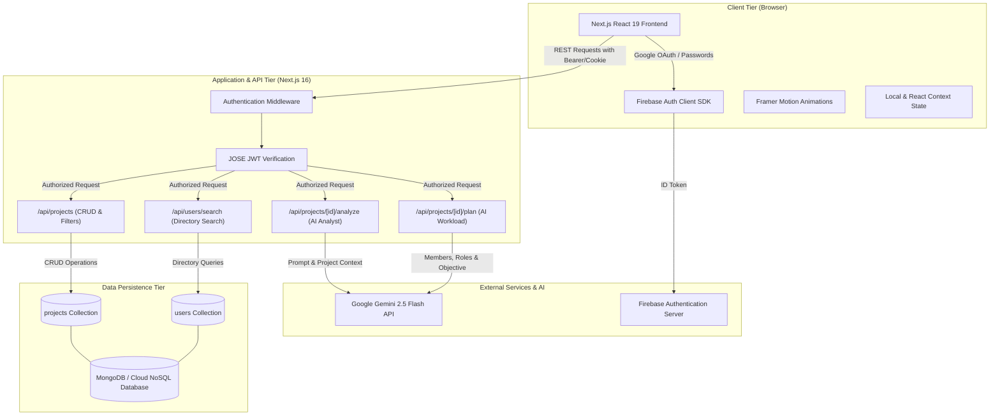
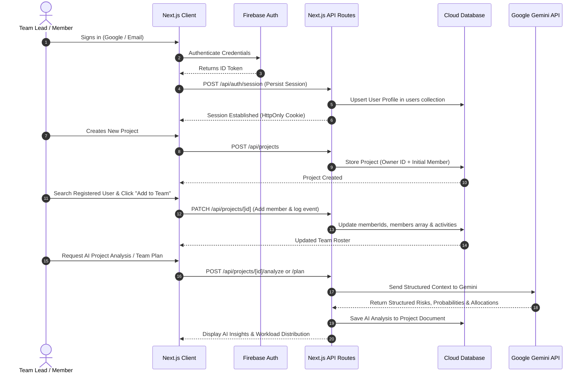

# InSightPM — AI-Powered Project Management & Intelligent Risk Monitoring Platform

[](https://nextjs.org/)
[](https://react.dev/)
[](https://www.typescriptlang.org/)
[](https://ai.google.dev/)
[](https://firebase.google.com/)
[](https://tailwindcss.com/)
[](https://vercel.com/)

---

## 📌 Project Overview

**InSightPM** is an enterprise-grade, cloud-native project management platform engineered to solve the most pervasive failure modes in modern software development: blind progress tracking, unquantified delivery risks, inefficient task allocation, and collaboration friction.

Built with **Next.js 16, TypeScript, Firebase Authentication, MongoDB / Cloud NoSQL storage, and Google Gemini AI**, InSightPM combines deterministic risk analysis with generative AI insights to transform static project management into an active, intelligent delivery copilot.

---

## 🚀 Key Features

### 1. 🔐 Robust Multi-Method Authentication
- **Secure Email & Password Authentication** with client-side credential validation.
- **One-Click Google OAuth 2.0 Sign-In** for seamless enterprise onboarding.
- **Stateless Session Persistence** powered by cryptographically verified JWT tokens (`jose`) over HttpOnly cookies.
- **Automatic User Directory Sync**: Automatically populates user profiles with avatar, name, and email into the searchable directory upon login.
- **Route Protection Middleware**: Server-enforced boundary keeping private routes and endpoints inaccessible to unauthorized callers.

### 2. 📊 Comprehensive Project Lifecycle Management
- **Full CRUD Capabilities**: Create, inspect, update, and delete projects with instant UI synchronization.
- **Owner & Ownership Delegation**: Explicit owner tracking with permission validation.
- **Standardized ISO 8601 Date Engine**: High-precision UTC date storage rendered cleanly in `DD/MM/YYYY` format with live relative countdowns (e.g., `Overdue by 3 days`, `Deadline is today!`, `4 days left`).
- **Dynamic Status Lifecycle**: Categorize initiatives across `Planned`, `In Progress`, `At Risk`, `Delayed`, and `Completed`.

### 3. 🧠 AI Project Analyst (Powered by Google Gemini)
- **Natural Language Progress Evaluation**: Evaluates team updates and commit notes against the project description and timeline.
- **Delivery Health Scoring**: Derives dynamic project completion probabilities based on qualitative updates.
- **Top Risk Identification**: Identifies architectural, temporal, and resource bottlenecks before they cause milestone slippage.
- **Prescriptive Recommendations**: Delivers actionable remediation steps directly to project managers.

### 4. 🧮 Deterministic Mathematical Risk Engine
- **Objective 0–100 Risk Quantification**: Bypasses subjective bias with a clear mathematical evaluation:
  - **Baseline Risk**: Directly proportional to remaining unfinished work (`100 - progress%`).
  - **Status Weighting**: Applies calibrated penalties (`+30` for `Delayed`, `+20` for `At Risk`).
  - **Temporal Decay Penalties**: Proximity and overdue scoring (`+50` for overdue, `+45` for deadline day, `+40` for ≤3 days left, `+25` for ≤7 days left).
- **Automated Risk Categorization**:
  - `Low Risk` (0–24)
  - `Medium Risk` (25–49)
  - `High Risk` (50–74)
  - `Critical Risk` (75–100)

### 5. 👥 Smart Direct Team Collaboration
- **Zero-Friction User Directory Search**: Instant email and display-name search across registered users.
- **Direct 1-Click Addition**: Project owners can add team members directly to projects without complex invitation flows, token expiries, or external service dependencies.
- **Instant Dashboard Visibility**: Added members see shared projects on their dashboard immediately with zero reload friction.
- **Role Assignment & Management**: Supports 8 specialized industry roles:
  - `Owner`
  - `Project Manager`
  - `Backend Engineer`
  - `Frontend Engineer`
  - `UI Designer`
  - `Tester`
  - `Documentation Lead`
  - `Viewer`
- **Granular Member Progress Tracking**: Individual completion percentage tracking per member with dynamic progress visualizations.

### 6. 🤖 AI Team Assignment Planner
- **Gemini-Powered Workload Balancing**: Synthesizes project objectives, scope, and registered member profiles.
- **Role & Task Decomposition**: Allocates concrete deliverables to individual team members based on their designated roles.
- **Skill Gap Detection**: Detects missing technical competencies (e.g., missing QA, unassigned DevOps) and flags proactive staffing warnings.

### 7. 📜 Comprehensive Audit & Activity Feed
- **Immutable Activity Logging**: Records real-time project events (member additions, removals, role reassignments, and progress milestones).
- **Reverse Chronological Timeline**: Displays who performed what action with exact timestamps.

### 8. 🎨 Premium Modern UI / UX
- **Deep Slate Dark Theme**: Built with Tailwind CSS and custom glassmorphism backdrops.
- **Fluid Motion Design**: Micro-interactions, animated tabs, and interactive card transitions powered by **Framer Motion**.
- **Responsive Layout**: Designed for mobile, tablet, and desktop viewports.

---

## 🏗️ System Architecture



---

## 🔄 User Workflow



---

## 💻 Tech Stack

| Domain | Technology | Version | Purpose |
|---|---|---|---|
| **Frontend Framework** | [Next.js](https://nextjs.org/) | 16.3.4 | App Router, Server Components, API Routing |
| **UI Library** | [React](https://react.dev/) | 19.2.8 | Declarative component hierarchy and reactivity |
| **Language** | [TypeScript](https://www.typescriptlang.org/) | 5.x | Strict end-to-end type safety |
| **Styling** | [Tailwind CSS](https://tailwindcss.com/) | 4.x | Utility-first responsive design, dark mode, glassmorphism |
| **Animation Engine** | [Framer Motion](https://www.framer.com/motion/) | 13.2.0 | Fluid transitions, animated modals, progress gauges |
| **Icons** | [Lucide React](https://lucide.dev/) | 1.43.0 | Modern SVG iconography |
| **AI Engine** | [Google Gemini API](https://ai.google.dev/) | `@google/genai` 2.21.0 | Project risk analysis and automated team planning |
| **Authentication** | [Firebase Auth](https://firebase.google.com/products/auth) | 12.18.0 | Email/Password & Google OAuth identity management |
| **Token Verification** | [jose](https://github.com/panva/jose) | 6.2.12 | Fast, zero-dependency JWT verification via JWKS |
| **Database** | [MongoDB / Cloud NoSQL](https://www.mongodb.com/) | Latest | Document persistence for projects and user profiles |
| **Deployment** | [Vercel](https://vercel.com/) | Cloud | Global CDN hosting, serverless edge function execution |

---

## ⚙️ Local Development Setup

### Prerequisites
- **Node.js**: `v20.x` or higher
- **npm**: `v10.x` or higher
- **Git**: Installed and configured
- **Firebase Project**: Created with Authentication enabled (Email/Password & Google)
- **Google Gemini API Key**: Obtained from [Google AI Studio](https://aistudio.google.com/)

### Step-by-Step Installation

1. **Clone the Repository:**
   ```bash
   git clone https://github.com/ChristianPlatel06/InSightPM.git
   cd InSightPM/project-monitor
   ```

2. **Install Dependencies:**
   ```bash
   npm install
   ```

3. **Configure Environment Variables:**
   Create a `.env.local` file in the root of the project:
   ```env
   # Firebase Client Configuration
   NEXT_PUBLIC_FIREBASE_API_KEY=your_firebase_api_key
   NEXT_PUBLIC_FIREBASE_AUTH_DOMAIN=your_project.firebaseapp.com
   NEXT_PUBLIC_FIREBASE_PROJECT_ID=your_firebase_project_id
   NEXT_PUBLIC_FIREBASE_STORAGE_BUCKET=your_project.appspot.com
   NEXT_PUBLIC_FIREBASE_MESSAGING_SENDER_ID=your_messaging_sender_id
   NEXT_PUBLIC_FIREBASE_APP_ID=your_firebase_app_id

   # Google Gemini API
   GEMINI_API_KEY=your_gemini_api_key
   ```

4. **Run the Development Server:**
   ```bash
   npm run dev
   ```

5. **Access the Application:**
   Open your browser and navigate to:
   ```text
   http://localhost:3000
   ```

6. **Validate Production Build:**
   ```bash
   npm run build
   ```

---

## 🌐 Deployment Guide (Vercel)

The application is optimized for zero-configuration deployment on **Vercel**:

1. **Push your code** to GitHub.
2. **Import the repository** into the [Vercel Dashboard](https://vercel.com/new).
3. **Configure the Environment Variables** in Vercel Project Settings:
   - Copy all variables from `.env.local` (`NEXT_PUBLIC_FIREBASE_*` and `GEMINI_API_KEY`).
4. **Deploy**:
   - Vercel automatically runs `next build` with Turbopack.
   - Global CDN and Serverless Functions are provisioned instantly.

---

## 📸 Screenshots & Interface Previews

> *High-resolution screenshots illustrating the core features of InSightPM:*

| View | Description | Preview |
|---|---|:---:|
| **Executive Dashboard** | High-level metrics, active projects, risk indicators, and team breakdown | `[ Dashboard Screenshot Placeholder ]` |
| **Deterministic Risk Card** | Mathematical risk score breakdown, progress gauge, and due-date countdown | `[ Risk Engine Card Placeholder ]` |
| **AI Project Analyst** | Gemini-powered completion probability, risk warnings, and recommendations | `[ AI Analyst Tab Placeholder ]` |
| **Smart Team Management** | Direct user search, 1-click addition, role selection, and contribution bars | `[ Team Roster & Roles Placeholder ]` |
| **AI Team Workload Planner** | Task breakdown and responsibilities synthesized by Gemini 2.5 Flash | `[ AI Team Planner Placeholder ]` |
| **Activity Audit Feed** | Chronological record of team additions, role switches, and project updates | `[ Activity Feed Placeholder ]` |

---

## 🔮 Future Enhancements

The architectural roadmap for InSightPM includes:

1. **Predictive Burndown & Velocity Analytics**:
   - Monte Carlo simulations forecasting project completion probability across multiple sprint cycles.
2. **Multi-Workspace & Organization Tenancy**:
   - Hierarchical workspace segregation allowing enterprise organizations to manage isolated departments.
3. **Automated VCS Activity Linking**:
   - Native GitHub and GitLab webhook integrations to automatically map git pull requests and commits to individual member completion metrics.
4. **Interactive Gantt & Milestone Timelines**:
   - Visual dependency mapping across interrelated sub-deliverables using interactive Canvas timelines.
5. **Data Export & Audit Compliance**:
   - Comprehensive project health and audit history export to PDF, CSV, and formatted JSON for stakeholder reviews.

---

## 👥 Contributors

InSightPM was engineered and documented by our dedicated cross-functional team:

| Name | Role | Responsibilities |
|---|---|---|
| **Christian Platel** | **Lead Software Architect & Full-Stack Engineer** | Core System Architecture, Next.js Full-Stack Engineering, Gemini AI Integration, Firebase Auth Engine, Mathematical Risk Engine, GitHub Management & Vercel Deployment |
| **Harinath** | **Technical Documentation & API Specialist** | API Specification, User Workflow Documentation, Architecture Documentation, System Verification |
| **Mansoordin** | **QA & Viva Presentation Specialist** | Quality Assurance, Edge Case Testing, Technical Presentation Structuring, Viva Defense Strategy |
| **Sathish** | **UI/UX & Frontend Presentation Specialist** | Design System Co-development, Component Aesthetics, Dark Mode Styling, Presentation Deck Engineering |
| **Prathiksha** | **Product Analyst & Project Reporter** | Feature Mapping, Requirements Analysis, Project Report Compilation, Academic Documentation |
| **Priyadharshini** | **Systems Diagram & Architectural Designer** | UML System Architecture Diagrams, Sequence Flow Modeling, Process Mapping, Technical Illustrations |

---

## 📄 License & Evaluation Note

This project is developed for hackathon evaluation, academic assessment, and technical portfolio review. All rights reserved by the development team.