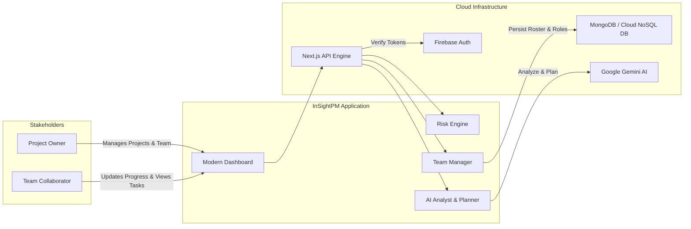

# Project Overview — InSightPM

## 1. Executive Summary

**InSightPM** is an advanced, AI-assisted project management and risk monitoring platform designed to provide transparent, quantifiable, and collaborative delivery governance. 

In conventional development environments, project tracking suffers from fragmented tools, subjective progress estimates, unmonitored deadline slippage, and inefficient resource allocation. InSightPM solves these challenges by uniting project lifecycle tracking, a deterministic mathematical risk engine, real-time team collaboration, and generative AI project intelligence (powered by Google Gemini) into a unified, high-performance web dashboard.

---

## 2. Core Value Proposition

InSightPM bridges the critical gap between passive issue tracking and active project intelligence:

1. **Objective Risk Quantification**: Replaces intuition-based project statuses with a deterministic 0–100 risk scoring algorithm based on progress remaining, status penalties, and temporal decay (proximity to deadline and overdue duration).
2. **Generative AI Health Diagnostics**: Utilizes Google Gemini to ingest qualitative updates and generate objective completion probabilities, top risk factors, and recommended next steps.
3. **Frictionless Direct Team Collaboration**: Implements a zero-barrier collaboration model where project owners can search any registered user and add them immediately to the project roster with zero onboarding delay or external dependencies.
4. **Intelligent Workload Distribution**: Synthesizes member skill sets, project requirements, and existing completion rates to generate optimized task distributions via the AI Team Assignment Planner.

---

## 3. Target Audience

InSightPM is specifically engineered for:

- **Student Engineering Teams & Academic Groups**: Needing transparent tracking, clear role distribution, and verifiable progress metrics for academic capstone and viva evaluations.
- **Hackathon Competitors**: Requiring rapid, zero-overhead project organization, instant team onboarding, and AI-assisted task division under tight time constraints.
- **Startups & Small Engineering Squads**: Seeking a streamlined, lightweight alternative to complex enterprise tools without losing out on sophisticated risk and workload analytics.
- **Project Leads & Technical Managers**: Needing instant, executive-level visibility into at-risk initiatives before deadlines are breached.

---

## 4. Key Functional Capabilities

| Capability Domain | Implemented Features | Operational Impact |
|---|---|---|
| **Identity & Access** | Email/Password, Google OAuth 2.0, Jose JWT Session Verification, Protected Routes | Guarantees isolated data access and secure authentication without external friction. |
| **Project Governance** | CRUD operations, Owner delegation, Dynamic status flags, UTC-safe ISO 8601 date management, DD/MM/YYYY formatting | Provides consistent project state management across global timezones. |
| **Risk Engine** | Deterministic 0–100 scoring model, 4-tier risk levels (`Low`, `Medium`, `High`, `Critical`), Real-time overdue penalties | Eliminates optimistic reporting; highlights endangered deliverables automatically. |
| **AI Project Analyst** | Qualitative update analysis, Completion probability assessment, Top risk identification, Prescriptive action items | Acts as an automated delivery consultant available 24/7. |
| **Smart Collaboration** | Directory search by email/name, Direct 1-click addition, Real-time membership sync, 8 predefined roles, Member completion bars | Enables immediate multi-user collaboration with zero onboarding lag. |
| **AI Team Planner** | Automatic deliverable decomposition, Role-based work allocation, Missing competency detection | Optimizes team output by matching technical requirements to member profiles. |
| **Audit & Governance** | Real-time reverse-chronological activity feed tracking member additions, role changes, and progress updates | Full traceability of team actions for retrospective analysis and evaluation. |

---

## 5. High-Level Operational Architecture

---

## 6. Business & Academic Impact

- **For Academic & Viva Evaluation**: InSightPM provides examiners and evaluators with a verifiable audit trail of team member contributions, quantifiable progress metrics, and live risk statuses.
- **For Engineering Velocity**: Eliminates administrative overhead by converting raw project logs into actionable AI roadmaps in seconds.
- **For Delivery Assurance**: Acts as an early-warning radar that flags slipping milestones before they become critical failures.