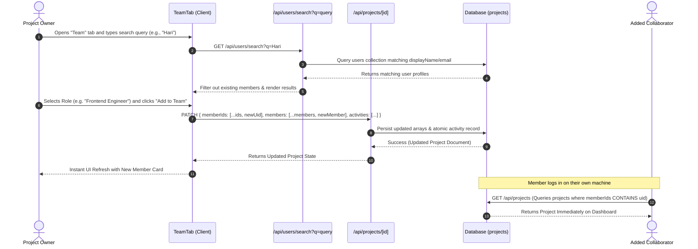

# System Architecture — InSightPM

## 1. Architectural Overview

InSightPM is designed as a modern, cloud-native, multi-tier web application built on **Next.js 16 (App Router)** and **TypeScript**, integrating decoupled authentication, high-performance database storage, and external AI reasoning engines.

The architecture emphasizes:
- **Stateless Serverless Execution**: API routes and server components execute as scalable serverless functions.
- **Cryptographic Security Boundaries**: Session verification is handled server-side using stateless JWT validation (`jose`) backed by public JWKS.
- **Deterministic & Generative Hybrid Processing**: Core calculations (Risk Engine) are deterministic and fast, while complex synthesis (Analyst, Team Planner) is offloaded to the Google Gemini 2.5 Flash model.
- **Direct Real-Time Data Sync**: Shared project state is immediately reflected across team members without intermediary message brokers or slow email polling loops.

---

## 2. Multi-Tier Architecture Diagram

```mermaid
flowchart TB
    subgraph Client ["Tier 1: Presentation Layer (Browser)"]
        BrowserUI["Next.js React 19 Frontend"]
        AuthContext["Auth Provider (Client Context)"]
        FramerEngine["Framer Motion Animation Engine"]
        ProjectViews["Dashboard / Project Details / Team Views"]
    end

    subgraph API ["Tier 2: Application & API Layer (Next.js 16)"]
        AuthMiddleware["Server-Side Auth Middleware (requireUser)"]
        JWKSValidator["JOSE JWT Validator (JWKS)"]
        ProjectRoutes["/api/projects & /api/projects/[id]"]
        AnalyzeRoute["/api/projects/[id]/analyze"]
        PlanRoute["/api/projects/[id]/plan"]
        UserSearchRoute["/api/users/search"]
        SessionRoute["/api/auth/session"]
    end

    subgraph External ["Tier 3: External Intelligence & Auth Providers"]
        FirebaseAuthService["Firebase Authentication Service"]
        GeminiAPI["Google Gemini 2.5 Flash LLM API"]
    end

    subgraph DataTier ["Tier 4: Data Persistence Layer"]
        Database[("MongoDB / Cloud NoSQL Database")]
        ProjectsCollection[("projects Document Collection")]
        UsersCollection[("users Document Collection")]
    end

    BrowserUI --> AuthContext
    AuthContext -->|OAuth / Password Verification| FirebaseAuthService
    FirebaseAuthService -->> AuthContext: Returns ID Token
    AuthContext -->|POST /api/auth/session| SessionRoute
    SessionRoute -->|Persist Profile| UsersCollection

    BrowserUI -->|Authenticated HTTP Requests| AuthMiddleware
    AuthMiddleware --> JWKSValidator
    JWKSValidator -->|Verified Request Context| ProjectRoutes
    JWKSValidator -->|Verified Request Context| AnalyzeRoute
    JWKSValidator -->|Verified Request Context| PlanRoute
    JWKSValidator -->|Verified Request Context| UserSearchRoute

    ProjectRoutes <--> ProjectsCollection
    UserSearchRoute <--> UsersCollection
    AnalyzeRoute --> GeminiAPI
    PlanRoute --> GeminiAPI
    AnalyzeRoute <--> ProjectsCollection
    PlanRoute <--> ProjectsCollection

    ProjectsCollection --- Database
    UsersCollection --- Database
```

---

## 3. Authentication & Session Flow

The authentication architecture combines client-side Firebase Auth with secure server-side JWT verification, ensuring that API routes independently verify user identity without hardcoded secrets.

```mermaid
sequenceDiagram
    autonumber
    actor User
    participant Client as React Client (AuthProvider)
    participant GoogleAuth as Firebase Auth Service
    participant SessionAPI as /api/auth/session
    participant ServerAuth as Server-Side Jose Validator
    participant DB as Cloud Database (users)

    User->>Client: Clicks "Sign in with Google" or submits Email/Password
    Client->>GoogleAuth: authenticateWithCredential()
    GoogleAuth-->>Client: Returns UserCredential & ID Token
    Client->>SessionAPI: POST { idToken }
    SessionAPI->>ServerAuth: verifyIdToken(idToken) via Google JWKS
    ServerAuth-->>SessionAPI: Validated Token Payload (uid, email, name)
    SessionAPI->>DB: Upsert user profile in users/{uid} collection
    SessionAPI-->>Client: Set-Cookie: session=token; HttpOnly; Secure; SameSite=Lax
    Client->>Client: Redirect to /projects Dashboard
```

---

## 4. Team Collaboration & Direct Member Addition Flow

To maximize reliability during live demonstrations and hackathon evaluations, InSightPM implements a **Direct 1-Click Addition Model** for immediate membership synchronization.



---

## 5. API Flow & Route Specification

| Endpoint | Method | Security | Functionality |
|---|---|---|---|
| `/api/auth/session` | `POST` | Public / Token | Verifies incoming ID token, creates session cookie, and upserts user document. |
| `/api/users/search` | `GET` | Authenticated | Searches registered users by email or display name prefix. |
| `/api/projects` | `GET` | Authenticated | Lists all projects where the authenticated user's UID is in `memberIds` or is `ownerId`. |
| `/api/projects` | `POST` | Authenticated | Creates a new project, initializes owner as first member, and registers `memberIds`. |
| `/api/projects/[id]` | `GET` | Authenticated | Retrieves project document after verifying membership. |
| `/api/projects/[id]` | `PATCH` | Authenticated | Updates project metadata, status, progress, member rosters, or activities. |
| `/api/projects/[id]` | `DELETE` | Authenticated (Owner) | Deletes project document; restricted strictly to the verified project owner. |
| `/api/projects/[id]/analyze` | `POST` | Authenticated | Invokes Gemini 2.5 Flash to generate project health insights and recommendations. |
| `/api/projects/[id]/plan` | `POST` | Authenticated | Invokes Gemini 2.5 Flash to generate automated task allocations across team members. |

---

## 6. Database Schema & Data Models

The system persists two primary document collections: **`users`** and **`projects`**.

### 1. `users` Collection Schema
```typescript
interface UserProfile {
  uid: string;            // Primary Identifier matching Auth UID
  displayName: string;    // Full name of the user
  email: string;          // User email address
  avatar: string;         // Profile photo URL
  roleTitle: string;      // Default professional title (e.g., "Full Stack Developer")
  skills: string[];       // Array of technical competencies (e.g., ["React", "TypeScript"])
  createdAt: string;      // ISO 8601 creation timestamp
}
```

### 2. `projects` Collection Schema
```typescript
interface Project {
  id: string;                         // Unique document ID
  name: string;                       // Project title
  description: string;                // Detailed scope description
  owner: string;                      // Display name of project creator
  ownerId: string;                    // Canonical UID of project owner
  memberIds: string[];                // Array of UIDs for fast membership filtering
  members: ProjectMember[];           // Detailed team roster
  status: ProjectStatus;              // "Planned" | "In Progress" | "At Risk" | "Delayed" | "Completed"
  progress: number;                   // 0-100 completion percentage
  dueDate: string | null;             // ISO 8601 UTC date string (YYYY-MM-DD)
  createdAt: string | null;           // ISO 8601 creation timestamp
  updatedAt: string | null;           // ISO 8601 last modified timestamp
  aiCompletionProbability: string | null; // AI predicted probability percentage
  aiTopRisks: string[] | null;        // Array of top risks identified by Gemini
  aiRecommendedActions: string[] | null; // Strategic remedial recommendations
  aiSuggestedPriorities: string[] | null;// High-priority short-term deliverables
  aiTeamPlan: AiTeamPlan | null;      // Structured team allocation plan
  activities: ActivityLog[];          // Immutable chronological audit events
}

interface ProjectMember {
  uid: string;
  name: string;
  email: string;
  role: string;                       // "Owner" | "Project Manager" | "Backend Engineer" | ...
  skills: string[];
  completion: number;                 // Individual member task completion percentage (0-100)
}

interface ActivityLog {
  id: string;
  description: string;
  timestamp: string;                  // ISO 8601 event timestamp
}
```

---

## 7. Security Architecture & Access Control

1. **Defense-in-Depth Authentication**: All API routes execute the `requireUser(request)` guard. The session cookie is parsed, decrypted, and validated against Google's public JSON Web Key Sets (JWKS).
2. **Access Isolation**: In `listProjects`, queries strictly filter using `ARRAY_CONTAINS` on `memberIds`. Users cannot read, discover, or enumerate projects they do not belong to.
3. **Owner-Restricted Operations**: Deletion and team management are strictly guarded by checking `project.ownerId === auth.user.uid`.
4. **Data Sanitization**: Date strings are sanitized and strictly validated against UTC date boundaries, eliminating timezone injection and NaN date parsing.
